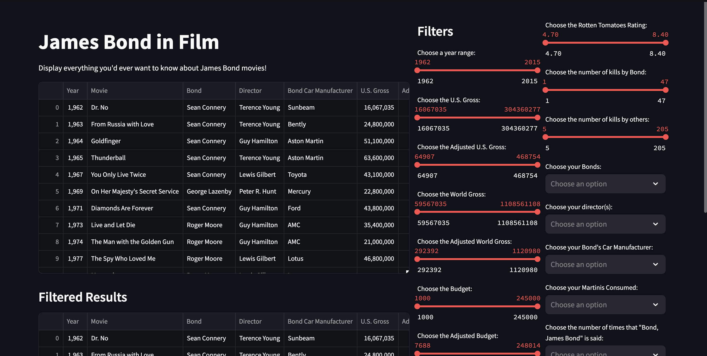
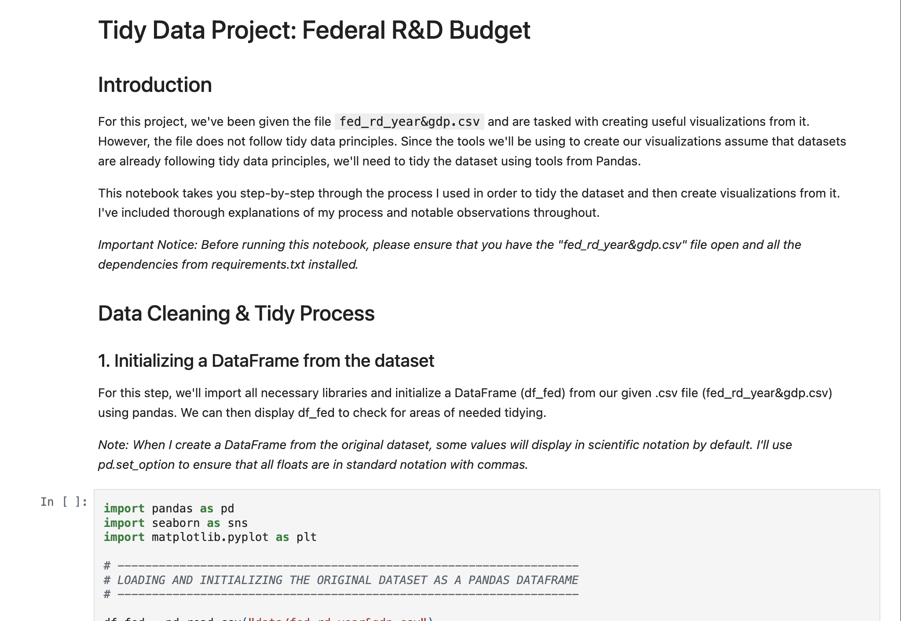
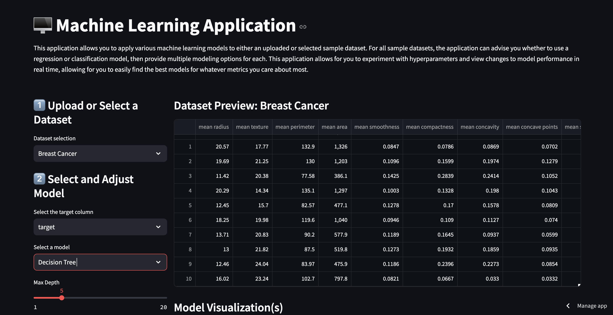
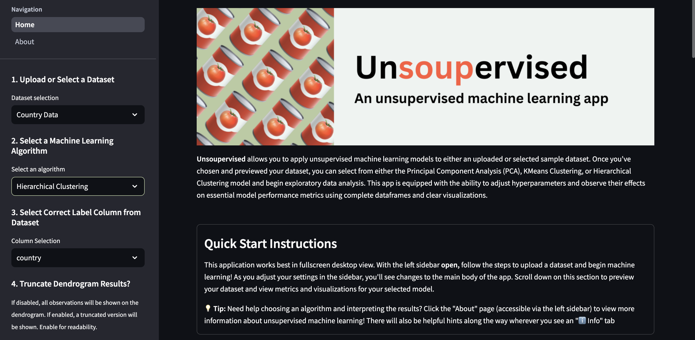

### Portfolio at a Glance:
* **My First Streamlit App:** Provides a way to compare films in the James Bond franchise utilizing basic Streamlit functions.
* **Tidy Data Project: Federal R&D Budget:** Applies principles of tidy data in order to analyze a budget dataset and produce meaningful visualizations from it.
* **Machine Learning App:** Streamlit app allowing users to upload a dataset and apply supervised machine learning models to it. Available on the community cloud.
* **Unupervised Machine Learning App:** Streamlit app allowing users to upload a dataset and apply unsupervised machine learning models to it. Greatly improves on design of previous application. Available on the community cloud.

 

### 1. My First Streamlit App: James Bond Franchise ([GitHub](https://github.com/cozette-brown/BROWN-Data-Science-Portfolio/tree/45df5288c5c65b926761bc3010556b5a969bd744/basic_streamlit_app))
This Streamlit app provides a way to explore similarities and differences between films in the James Bond franchise. It incorporates basic elements of Streamlit app development, with room for further improvement as I learn additional capabilities using Streamlit and other packages.   
**Tools & Skills Showcased:**
* Python
* Pandas
* Streamlit

### 2. Tidy Data Project: Federal R&D Budget ([GitHub](https://github.com/cozette-brown/BROWN-Data-Science-Portfolio/tree/45df5288c5c65b926761bc3010556b5a969bd744/TidyData-Project))

This project in Jupyter Notebooks applies the principles of tidy data in order to prepMachare a provided dataset for analysis and create meaningful data visualizations from it. In step-by-step format, I showcase how I've learned to use tidy data principles, which are a vital part of making datasets usable for real-world analysis.   
**Tools & Skills Showcased:**
* Python
* Pandas
* Matplotlib
* Seaborn

### 3. Machine Learning App ([GitHub](https://github.com/cozette-brown/BROWN-Data-Science-Portfolio/tree/main/MLStreamlitApp)) | ([Streamlit Community Cloud](https://cozettebrown-machine-learning-app.streamlit.app/))
This Streamlit app allows users to use various machine learning models, experiment with hyperparameters, and evaluate models using either sample datasets or their own uploaded file. It integrates what I've learned so far about machine learning and creating meaningful visualizations, such as confusion matrices, to understand and convey important information about data.  
**Tools & Skills Showcased:**
* Python
* Streamlit
* Supervised Machine Learning w/ Sklearn
* Matplotlib
* Seaborn

### 4. Unsupervised Machine Learning App: Unsoupervised ([Github](https://github.com/cozette-brown/BROWN-Data-Science-Portfolio/tree/main/MLUnsupervisedApp)) | ([Streamlit Community Cloud](https://unsoupervised.streamlit.app/))
This Streamlit app allows users to use unsupervised learning models, experiment with hyperparaments, and evaluate models with resulting metrics and visualizions—all using an uploaded dataset or one of the available demos. It greatly improves upon my previous Streamlit app, showcasing not only my new understanding of unsupervised models but also my improvement in Streamlit design.
**Tools & Skills Showcased:**
* Python
* Streamlit
* Unsupervised Machine Learning w/ Sklearn
* Matplotlib

